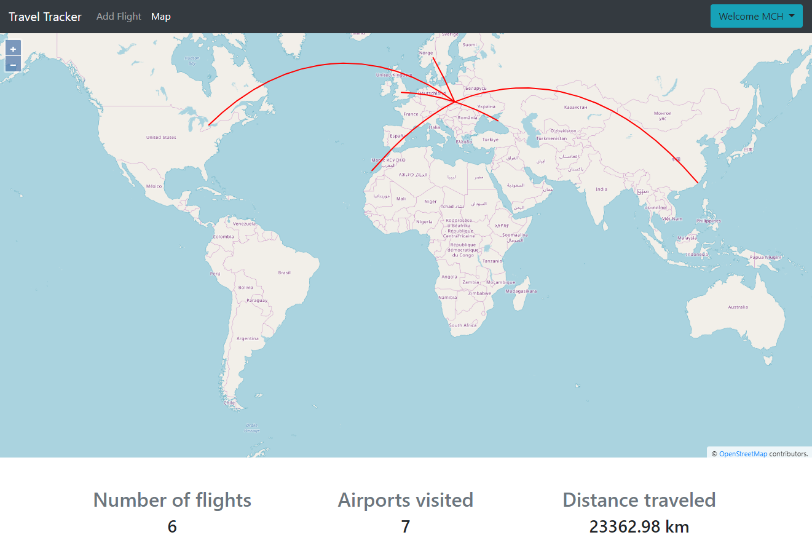

# TravelTracker
It's a simple single-page application that allows users to track their flights, and display them on a map. It uses .NET Core and Entity Framework Core to create an API that provides data for Angular application. It also utilizes JWT tokens for authentication. Data is stored in MSSQL database which was created using code-first migrations. Flights are displayed on a map thanks to the OpenLayers library along with arc.js which is used to calculate great circle routes for each flight.

# Screenshots

